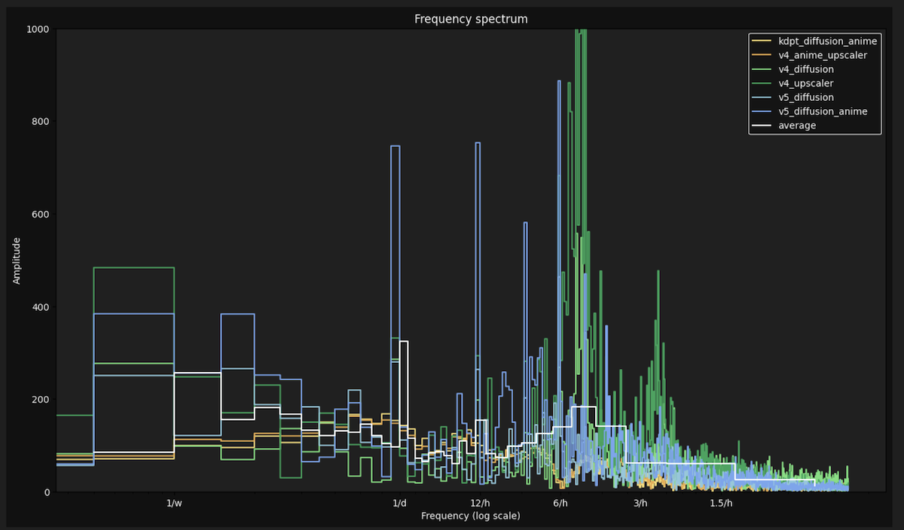
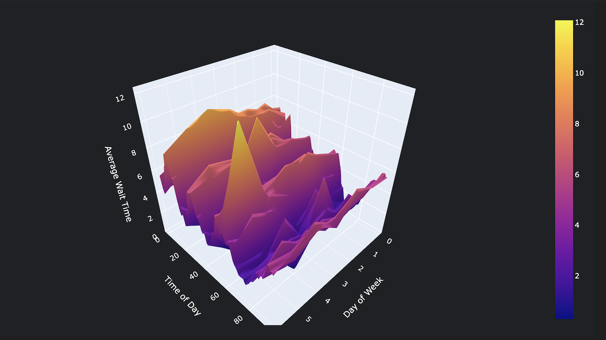
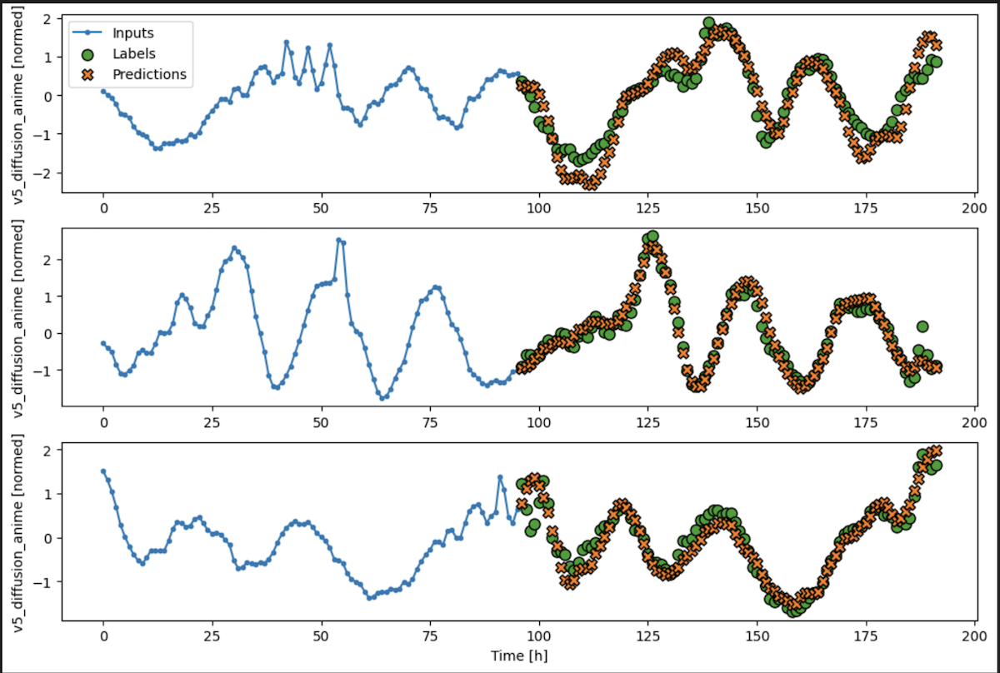

# MJ Timeseries

Predict slow wait times in Midjourney using machine learning.

End-to-end time series prediction using cronjobs for data collection, ETL, machine learning for forecasting, and finally data visualization in JS.

## Pipeline

Fetch -> ETL -> Analytics -> ML.

All deployed to AWS, except for ML (work in progress)

## Analytics    

### Frequency Analysis.

Decompose series data into frequencies for feature selection.

### Exploratory Data analysis.

Using various tools for understanding data over time.

### Forecasting with ML.

Forecasting the next window of time based on previous window.

### Data visualization.

Front-end JS visualization.

